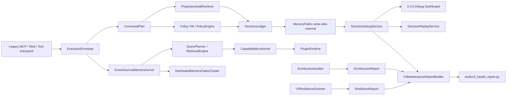

# OmbreBrain v2.4.0 Architecture

OmbreBrain v2.4.0 keeps the original OB user-facing behavior and adds a deeper internal architecture around the legacy runtime. The main contract is:

`ExecutionEnvelope -> CommandPlan -> ProjectionAuditRuntime -> PolicyEngine -> DecisionLedger -> DecisionDebugService`

The deeper post-hardening path adds:

`FormalAcceptanceHarness -> EventSourcedMemoryKernel -> QueryPlanner -> CapabilityMicrokernel -> PluginRuntime -> DistributedMemoryFabricCluster`

The replay path is intentionally separate:

`DecisionRecord -> DecisionReplayService -> replay report`

## Execution Flow



The legacy operation still performs the same useful work. The v2.4.0 architecture layer observes, plans, evaluates, records, and replays decisions without replacing the public tool contract.

## Layer Contracts

| Layer | Main objects | Mode | Contract |
| --- | --- | --- | --- |
| protocol | event schemas | audit-only | Normalize architecture event data without changing legacy payloads. |
| domain | `CommandPlan`, invariants | audit-only | Build a stable command description from each old OB action. |
| app | `ExecutionEnvelope`, `LegacyRuntime` | write-side-channel | Bridge old calls into architecture metadata while preserving legacy return values. |
| projection | `ProjectionAuditRuntime`, Projection observers | audit-only | Check bucket, trace, policy, and surface projections without owning legacy state. |
| policy | Policy VM, `PolicyEngine` | audit-only | Evaluate capability contracts and protected surface risk. |
| decision | `DecisionLedger`, `DecisionRecord`, `DecisionDebugService`, `DecisionReplayService` | audit-only/read-only | Record and inspect decision metadata from the architecture side channel. |
| fabric | `MemoryFabric` | write-side-channel | Append architecture trace metadata to the local WAL, separate from legacy bucket markdown. |
| architecture | `ComponentGraph`, `ArchitectureAuditor`, `ArchitectureReport` | read-only | Verify that critical architecture components, dependencies, and ownership contracts still line up. |
| resilience | `V3ResilienceScanner`, `ResilienceReport` | read-only | Replay WAL and inspect decision/projection metadata without mutating state. |
| maintenance | `V3MaintenanceReportBuilder` | read-only | Combine architecture, resilience, and recent decisions into one offline health report. |
| acceptance | `FormalAcceptanceHarness` | read-only | Locks MCP names, dashboard routes, bucket markdown fields, and protected surfaces. |
| eventsourcing | `EventSourcedMemoryKernel` | audit-only | Builds command-event-projection metadata without taking over bucket files. |
| retrieval | `QueryPlanner`, `RetrievalEngine` | read-only | Produces explainable retrieval plans and traces for breath/search. |
| microkernel | `CapabilityMicrokernel` | audit-only | Centralizes capability permission and side-effect decisions. |
| plugins | `PluginRuntime`, `PluginSandbox` | audit-only | Allows constrained extensions only through declared capabilities. |
| distributed | `DistributedMemoryFabricCluster` | write-side-channel | Provides local production-grade membership, leader lease, quorum commit, and catch-up abstractions. |

## Side Effect Model

`read-only` means the component only inspects existing state. It must not append WAL events, modify bucket markdown, alter config, or call external services.

`audit-only` means the component derives plans, verdicts, consistency observations, or debug metadata. It may produce in-memory structures that another layer can embed in an event.

`write-side-channel` means the component may write only architecture diagnostic records, normally through `MemoryFabric`. It must not become the owner of legacy bucket files, vector data, deployment files, OAuth secrets, or the dashboard route contract.

`write-legacy-state` is reserved for old OB modules that already own legacy state. New architecture components avoid this mode unless a future migration intentionally moves ownership.

## Runtime Integration

`LegacyRuntime` is the adapter point. It receives old OB configuration, constructs the architecture runtime helpers, and records architecture trace metadata after the original operation has been shaped into an execution envelope.

The recorded metadata contains:

- command plan identity and payload shape
- policy verdict and capability contract
- projection journal and consistency report
- decision record
- protected path and protected surface observations

The public behavior remains the old behavior: MCP tool names unchanged, request parameters unchanged, return text unchanged, bucket markdown unchanged, and Dashboard existing routes unchanged.

## Debug And Replay

`DecisionDebugService` lists recent decision records from local architecture trace metadata and reports malformed records as problems. `DecisionReplayService` rebuilds the decision summary without re-running the original legacy action, so replay is a safe diagnostic path.

The Dashboard 2.4.0 debug view calls read-only APIs. It does not write config, buckets, OAuth settings, or deployment files.

## Architecture And Resilience Checks

`ComponentGraph` describes critical architecture components, their dependencies, owned surfaces, and side effect mode. `ArchitectureAuditor` returns an `ArchitectureReport` and detects missing critical components, unknown dependencies, dependency cycles, read-only ownership mistakes, and duplicate write ownership over protected surfaces.

`V3ResilienceScanner` returns a `ResilienceReport`. It replays the local WAL, checks decision debug output, and flags metadata shape drift. It is read-only and does not advance the fabric index.

## Maintainer Command

Run the offline report locally:

```powershell
py -3.10 tools/v3_health_report.py --buckets-dir buckets --output reports/v3-health.json
```

`tools/v3_health_report.py` creates a `V3MaintenanceReportBuilder`, then combines `ArchitectureReport`, `ResilienceReport`, runtime metadata, and recent `DecisionRecord` summaries. It is a local-only maintainer tool and does not contact GitHub, Docker, Zeabur, Render, or any cloud server.

## Deep Kernel Sequence

The F -> B -> C -> D -> E -> A sequence keeps v2.4.0 as the public version line and adds deeper code without changing the public OB contract:

- F: `FormalAcceptanceHarness` turns compatibility into a machine-checkable contract.
- B: `EventSourcedMemoryKernel` records command-event-projection summaries in architecture metadata.
- C: `QueryPlanner` and `RetrievalEngine` add explainable retrieval planning for breath/search.
- D: `CapabilityMicrokernel` routes capability dispatch through a central policy boundary.
- E: `PluginRuntime` introduces sandboxed extension execution.
- A: `DistributedMemoryFabricCluster` adds local production-grade distributed fabric primitives.
